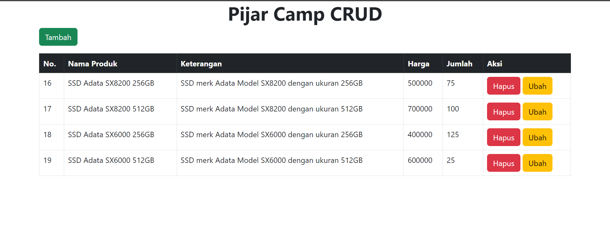
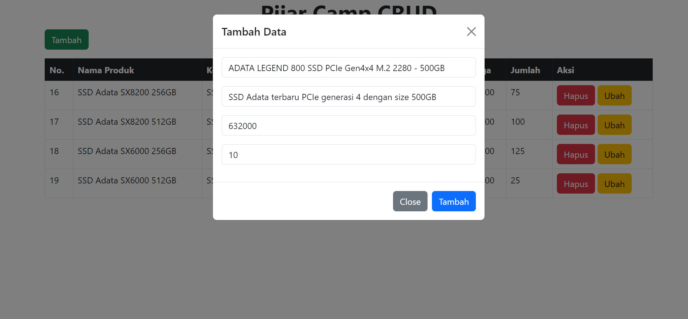
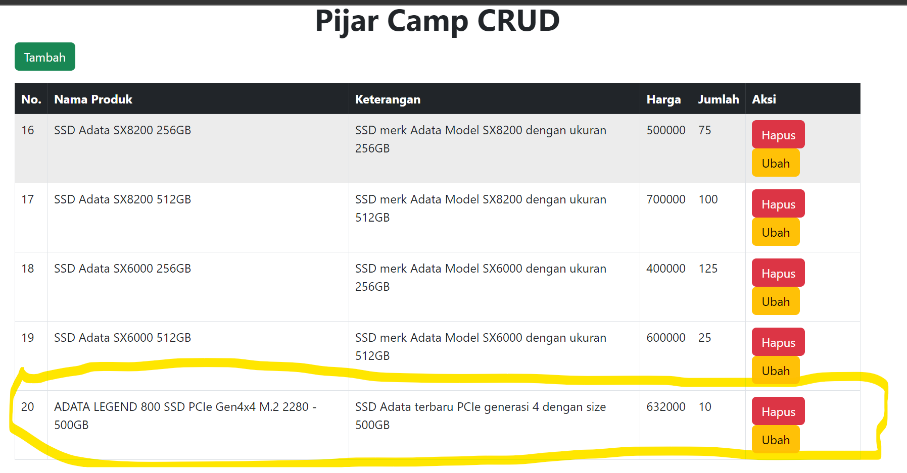
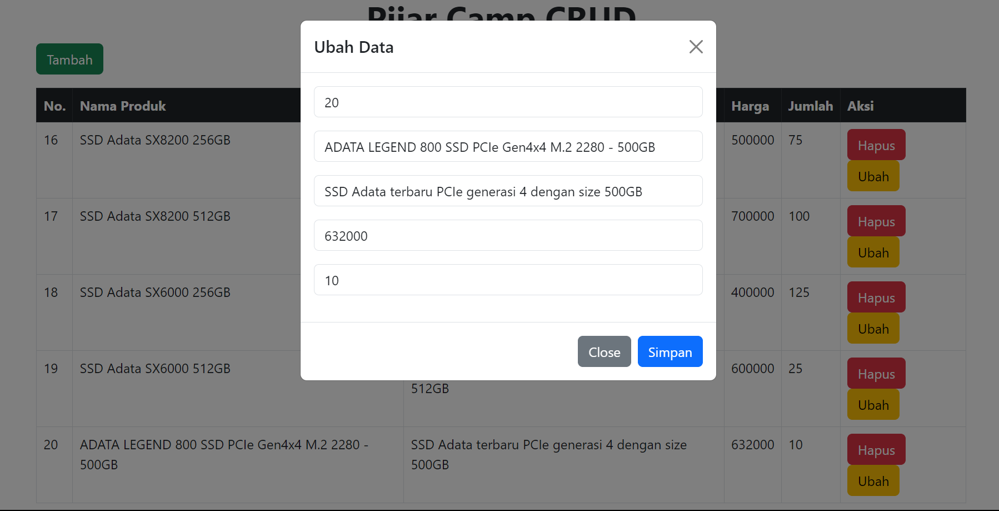
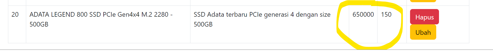
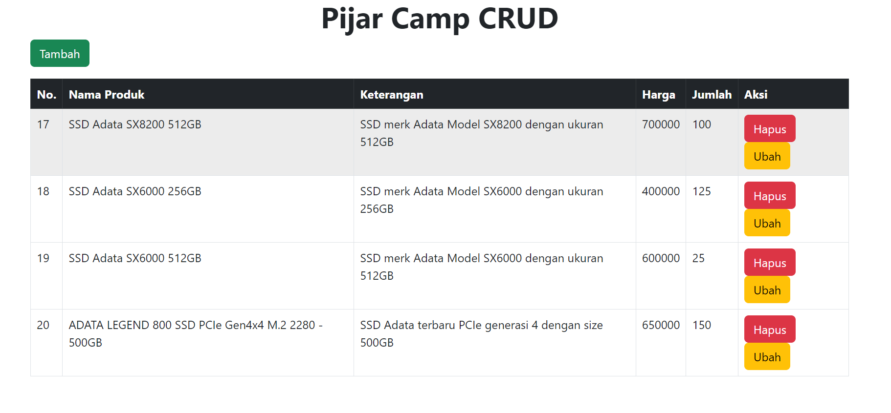

# pijar_camp
# Level 3 Tugas 10 Membuat aplikasi CRUD
## Halaman Landing aplikasi

## Menambah data
### Klik tombol tambah dan modal form untuk menambahkan data akan muncul

### Data kemudian ditambahkan ke database dan halaman diupdate

## Mengupdate Data
### Sama seperti fitur tambah, modal form untuk mengupdate data akan muncul ketika tombol ubah diklik beserta data dari baris yang dipilih

### Kemudian untuk contoh ini kita ubah harga menjadi 650000 dan jumlah barang menjadi 150

## Menghapus data
### Saat tombol hapus diklik maka data akan langsung terhapus dan kemudian halaman direfresh. Pada contoh kali ini kita akan menghapus data pertama.
;
